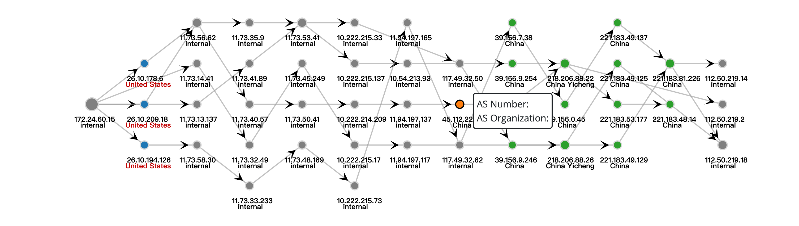

# Network Topology Visualization
Visualize traceroute（可视化traceroute）
Based on JavaScript and d3.js(not need to download d3, already included in the project), this project is to visualize the network topology.

The most typical scenario is visualizing traceroute results.

Input:  Input data format like this

```
// .... 每个节点的信息
nodes: {
    "223.102.46.126": {
        "addr": "中国_辽宁_大连_庄河",
        "city": "China",
        "asn": 56044,
        "asn_name": "China Mobile communications corporation",
        "is_abroad": false
    },
    "111.45.201.89": {
        "addr": "中国_辽宁_大连",
        "city": "China",
        "asn": 56044,
        "asn_name": "China Mobile communications corporation",
        "is_abroad": false
    }, 	
},
// 节点之间的拓扑关系
  edges: [
    {'0': '223.102.46.126', '1': '192.168.1.1', '2': '10.46.0.1', '3': '111.45.201.89', '4': '211.137.46.229', '5': '211.137.36.153', '6': '211.137.47.138', '7': '211.137.47.137', '8': '111.24.7.237', '9': '221.183.104.38', '10': '221.183.89.41', '11': '221.183.89.70', '12': '221.183.89.173', '13': '223.120.3.185', '14': '223.120.3.122', '15': '223.119.6.101', '16': '192.203.230.10', '17': '199.7.91.13', '18': '1.1.1.1', '19': '4.68.72.130', '20': '198.97.190.53', '21': '192.5.5.241', '22': '8.8.8.8'},
    {'0': '223.102.46.126', '1': '192.168.1.1', '2': '10.46.0.1', '3': '111.45.205.89', '4': '211.137.46.225', '5': '211.137.47.45', '6': '211.137.47.18', '7': '211.137.47.17', '8': '111.24.7.237', '9': '221.183.117.205', '10': '221.183.94.22', '11': '221.176.23.42', '12': '159.226.254.69', '13': '159.226.254.158', '14': '223.120.6.54', '15': '218.241.102.102', '16': '192.58.128.30', '17': '4.35.156.66', '18': '137.164.11.71', '19': '130.152.185.10', '20': '130.152.184.101', '21': '199.9.14.201', '22': '199.7.91.13', '23': '202.12.27.33', '24': '208.67.222.222', '25': '1.1.1.1', '26': '198.97.190.53', '27': '192.5.5.241', '28': '8.8.8.8'},
  ]
```

Output: a svg container

If you run it in a browser, you can generate dynamic charts similar to echarts

If running in Node.js, you can batch generate topologies based on input data and save.SVG and.png (which I implemented but haven't commit yet)




## How to use

I modeled the design after Echarts' approach to how to use the API.


### 1. Download

download` dist/ntv.bundle.js`. 

I packaged all the dependent libraries (d3 and Jquery) and functionality into this file via **webpack**, and I just needed to download the file to use the full functionality

### 2. Use

You just need to download file `example/index.html` to quickly learn how to use and see the display effect. Or read the information below，although it's just the copy of `index.html`

**Attention: modify the path of `ntv.bundle.js` in the `index.html`**

```
<!DOCTYPE html>
<html>
  <head>
    <meta charset="utf-8" />
    <title>Network Topology Visualization</title>
    <script src="../dist/ntv.bundle.js"></script>
  </head>

  <body>
    <div id="topo_graph" style="width: 600px;height:400px;"></div>
    <script type="text/javascript">
 
      var myNtv = ntv.init(topo_graph);

      // 指定图表的配置项和数据
      var option = {
        data: {
        	// 省略的数据，太多了，可以将index.html中的该部分拷贝过来
        	// 或者实际使用时，你可以选择读取文件，接收API输出等方式来传递数据
        },
        style: {
          "width": 100,
          "height": 100,
          "x_gap": 90,
          "y_gap": 70,
          "radius": 6,
          "max_radius": 20,
          "stroke_width": 2,
          "margin_ver": 20,
          "margin_hor": 40,
          "offset_ver": 30
        },
        meta: {
          "color_label": "asn",
          "down_labels": ["key", "addr"],			// 每个节点下方显示的信息
          "over_labels": ["asn", "asn_name"],	// 鼠标悬停节点时显示的信息
          "labels": ["asn", "asn_name", "addr"] // 标签总类（必须包括down_labels和over_labels，用于构造节点）
        }
      };
      
      myNtv.setOption(option);
    </script>
  </body>
</html>

```

## TODO

- [ ] option.style: add description 
- [ ] merge Node.js functionality support and add batch plotting and save
- [ ] merge Browser svg picture download function
- [ ] A better algorithm calculates the Y-axis position of the nodes, reducing the crossing of edges

Progress depends on your needs

## After

If any question, I'm glad to answer and solve.
I suggest using issue to communicate, or through my email
zhaoyunlei22s@ict.ac.cn

这是我在工程项目的中的一个需求，可视化traceroute结果，但是找遍了各大前端可视化库(例如Echarts)，都无法实现，所以选择使用d3.js从底层自己写了一个，希望能帮助到有相关需求的人。

这是我的第一个完整开源库，我没有深入研究过Javascript，如果发布基于Javascript的开源库也是照猫画虎十分粗糙，有任何问题（代码功能，开源库的格式，证书，安全等）感谢各位大佬指正。

欢迎大家star！！！